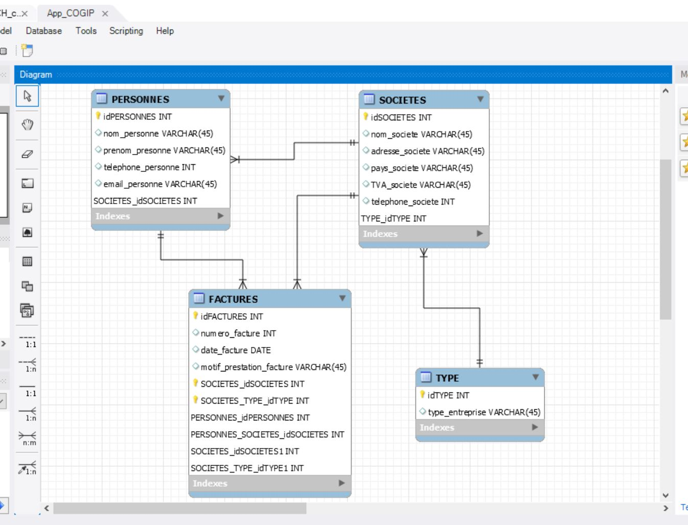

# COGIP-App

- **Repository**: `COGIP-App`

- **Duration** : `5 Days`

- **Deadline** : `Tuesday 04/09 at 17:00`

- **Made by**  
  - [Marco Bove](https://github.com/marcomisco)
  - [Marie Louise Ogdoc](https://github.com/OGlou7)
  - [Jean-François Geerinckx](https://github.com/JFGEER83)

- **Where?**
 A project done while in the training at [Becode](https://github.com/becodeorg/)

## About the Project
It is just an exercise from [BeCode](https://github.com/becodeorg/)

## Objective
https://github.com/becodeorg/Johnson2/tree/master/projets/COGIPapp

## Workbench

## What [Marco Bove](https://github.com/marcomisco) did :

*
*
*

## What [Marie Louise Ogdoc](https://github.com/OGlou7) did :

*
*
*

## What [Jean-François Geerinckx](https://github.com/JFGEER83) did :

*
*
*

## Lighthouse Test

<!--  -->

## Link to the final project
